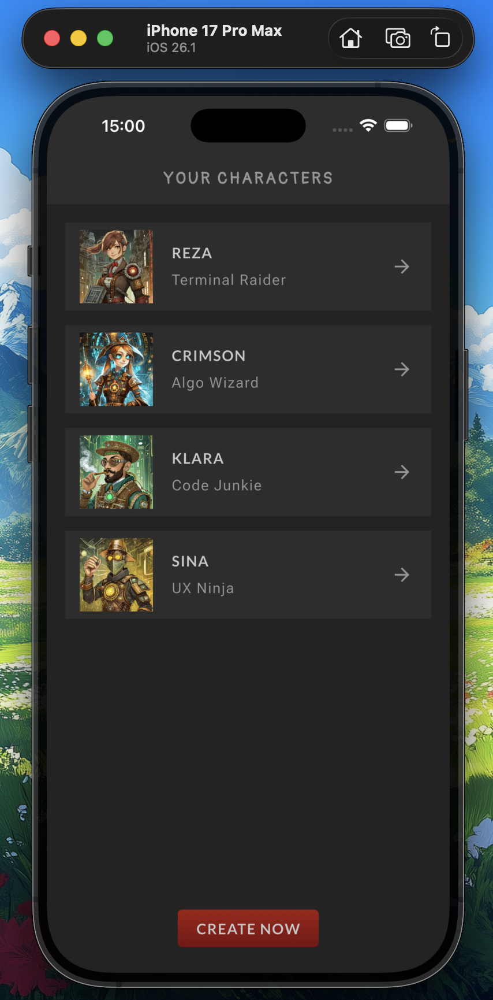
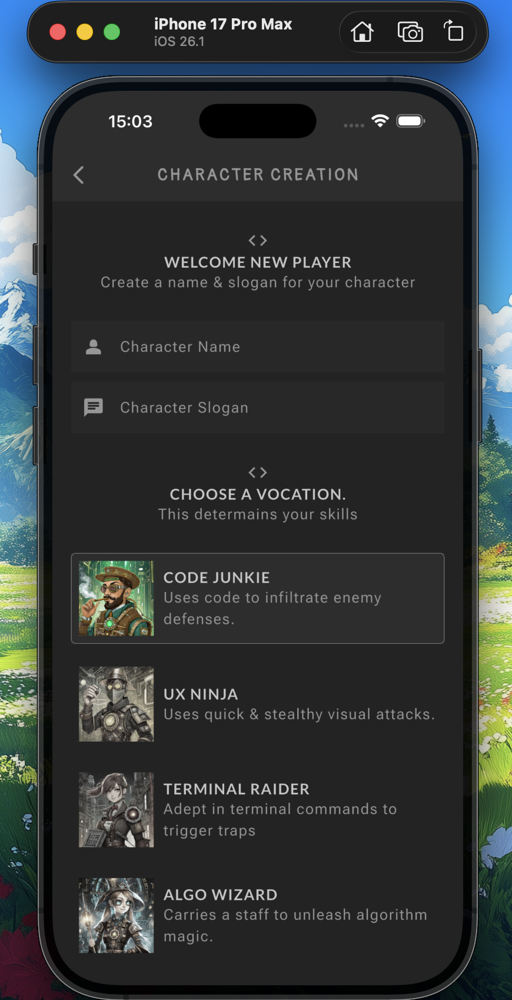
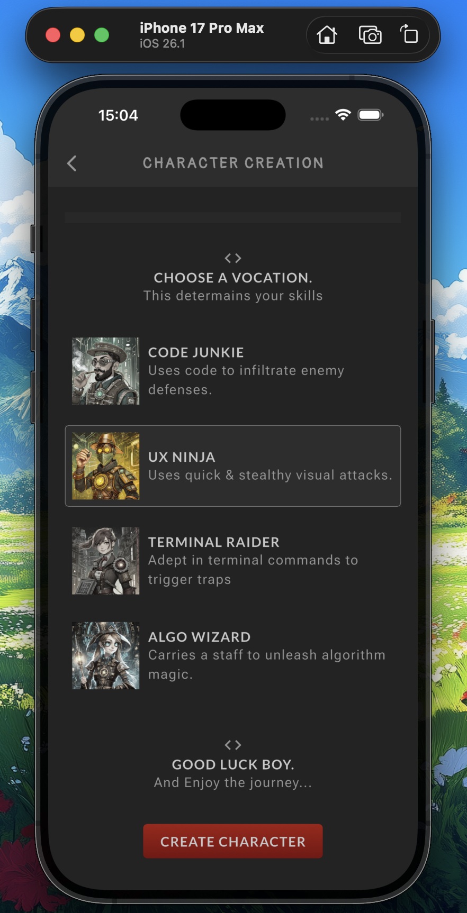
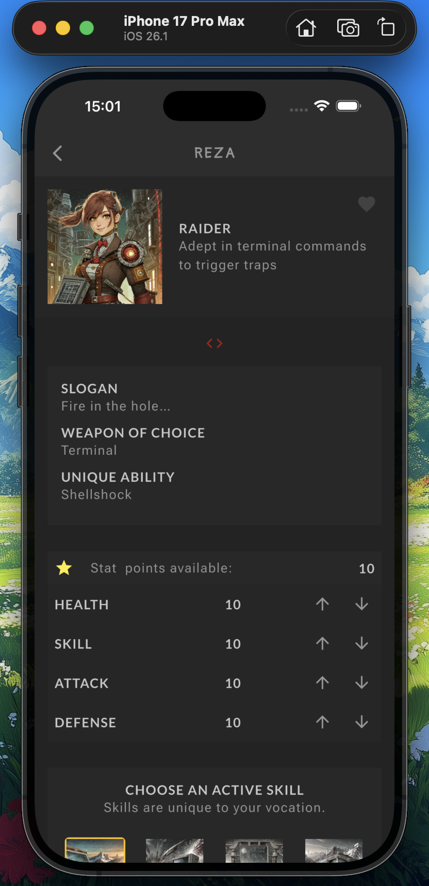
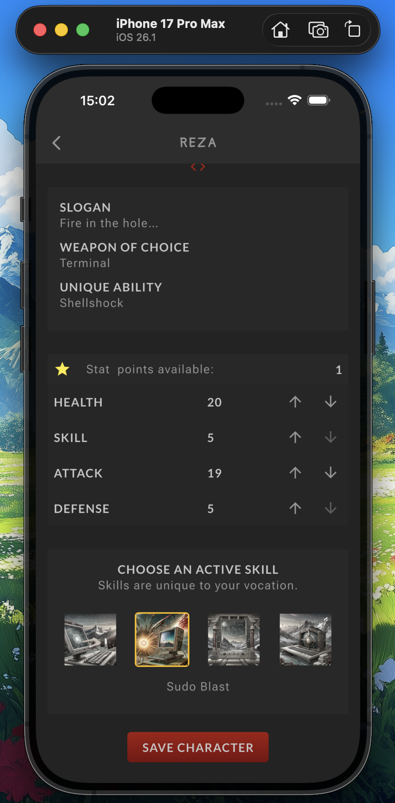

# RPG Character App

A Flutter application for creating, managing, and viewing RPG characters with custom stats, vocations, and skills.


## 🚀 Features

- Create RPG characters
- Choose vocation, abilities, weapons, and stats
- Manage skills with clean UI
- View formatted character details
- Firestore-backed storage

## 🛠️ Tech Stack

- **Flutter** (Dart)
- **Firebase Firestore**
- **State Management**: Provider


## 📂 Folder Structure

```
lib/
├── models/
├── screens/
├── services/
└── shared/
├── main.dart
|-- theme.dart
|-- firebase_options.dart
```
## 🔧 Getting Started

### 1. Clone the repo

```sh
git clone git@github.com:Sina-shafiee/flutter_rpg.git
```

### 2. Install dependencies
```sh
flutter pub get
```
### 3. Configure Firebase

3.1 Install firbase CLI [Click Here.](https://firebase.google.com/docs/cli#setup_update_cli)

3.2 install flutterfire CLI
```sh
dart pub global activate flutterfire_cli
```

3.3 create a project inside [firebase console](http://console.firebase.google.com/)

3.4 configure firebase
```sh
flutterfire configure
```

### 4. Run the app
```sh
flutter run
```

## 🤝 Contributing
Contributions are welcome!

Feel free to open issues and pull requests.

## 📜 License
[](https://opensource.org/licenses/MIT)


## Screenshots

<div style="display: flex; flex-wrap: wrap; gap: 10px;">
  
  
  
  
  
</div>

